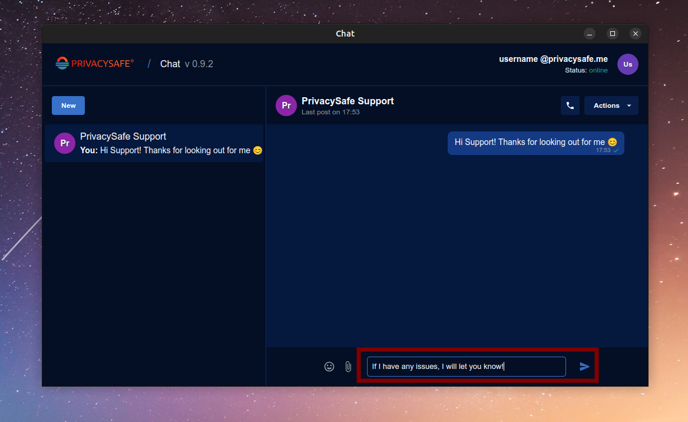
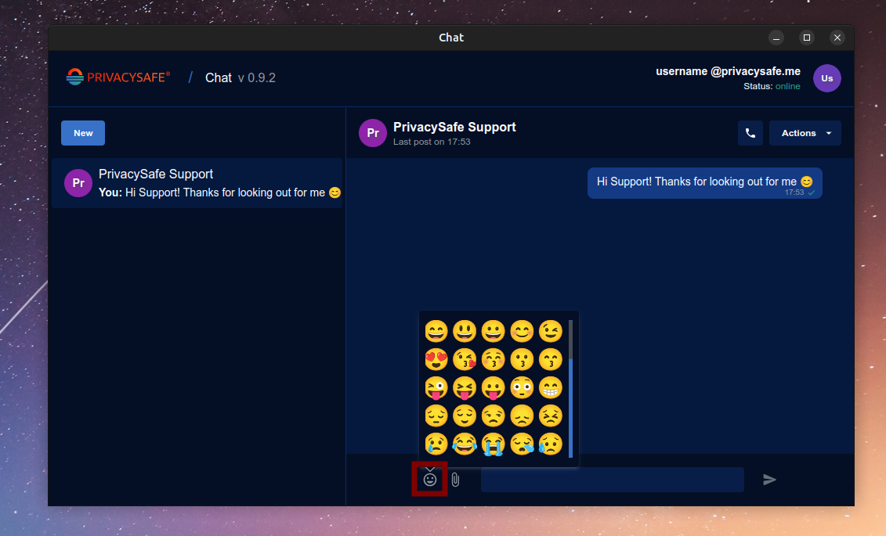

# 🛡️ PrivacySafe: Speak, Share &amp; Work Safely

Welcome to [PrivacySafe](https://privacysafe.app)! Our apps deliver privacy and security while you communicate, collaborate, and work. PrivacySafe apps run locally on your machine and interact with zero-knowledge servers. What does that mean? Simply put, the servers don't know who you are, what you're doing, or even which apps you're using.

## 🔒 PrivacySafe Enterprise Suite

Our Enterprise Suite is a bundle of productivity tools for your organization that either uses our PrivacySafe Service for identity and authentication or, optionally, your organization's internal network and access controls. We deliver secure collaboration tools that replace apps like **Signal**, **Telegram**, **WhatsApp**, and **DropBox**. Even the most powerful officials can [make mistakes](https://psafe.ly/3DHNgz) when attempting to communicate securely &ndash; with our Enterprise Suite, your people have approved communication tools for both routine tasks and high-risk situations. These apps are confidential and portable, running smoothly on all major desktop operating systems (Windows, Mac, and GNU/Linux).

### Key Features
- 💬 **Secure Chat**: Private, end-to-end encrypted (E2EE) messaging for your team.
- 📞 **Video Calls**: High-quality, secure video meetings without any worry.
- 📂 **Encrypted Storage**: Keep your files safe with zero-knowledge encryption.
- 👥 **Private Contacts**: Store and manage contacts privately, without any third-party access.
- 🔄 **Verified Updates**: Automatic, verified updates to keep your apps secure and up-to-date.
- 🧰 **Sandboxed Tools**: A safe, compartmentalized environment for collaboration.

We all know how important it is to keep your data private. That's why PrivacySafe gives you full control over your information &ndash; without any of the tracking or data collection you might find in other apps. All of our code is free and [open source software](https://github.com/PrivacySafe) (FOSS), which means security researchers and developers can inspect the code and contribute improvements. We also host ourprotocols, formats, and APIs at [IEEE SA Open](https://opensource.ieee.org/3nweb), the world's largest and most respected technical professional organization.

As a partner of PrivacySafe, you're getting a secure, sandboxed environment for your organization. With our help, you can integrate secure collaboration into your domain and controls, deploying a custom security solution that can even feature your branding.

## 📥 Download &amp; Install PrivacySafe Enterprise Suite

Ready to get started with PrivacySafe? Deploying our suite of secure tools is quick and easy.

🌐 All versions of our Enterprise Suite are hosted at [https://download.privacysafe.app/nightly/](https://download.privacysafe.app/nightly/)

**Please follow the instructions below for your operating system (Windows, Mac, or GNU/Linux).**

<p align="center">
<a href="https://download.privacysafe.app/nightly/" target="_blank">

</a>
</p>

### 🛠️ System Requirements

Before downloading, make sure your system meets the minimum requirements:

| Operating System | Minimum Requirements | Installer Type |
| ---------------- | -------------------- | -------------- |
| **Windows** | 64-bit Windows 7 or newer | .exe |
| **macOS** | macOS 10.12 or newer | .dmg |
| **GNU/Linux** | 64-bit OS (x86_64 or ARM64) | AppImage, .deb, snap, .rpm |

### Windows Instructions
 - **[Download Windows Installer](https://download.privacysafe.app/nightly/windows/PrivacySafe-Setup-x64.exe)** (.exe file)
 - SHA256 &amp; SHA512 checksums for Windows downloads are [published here](https://download.privacysafe.app/nightly/windows/checksums.json).
 This is an optional step to verify the integrity of the downloaded file.
 
 Example command for checking the SHA256 checksum on Windows:

 ```powershell
 certutil -hashfile PrivacySafe-Setup-x64.exe SHA256
 ```
 - Run the Windows `PrivacySafe-Setup-x64.exe` installer and you're up and running!

### MacOS Instructions
 - Browse the [List of Mac Installers](https://download.privacysafe.app/nightly/mac/) (.dmg files)
 - **Newer Mac models** must download the installer for Apple Silicon chipsets (M1, M2, M3, M4): 
 [PrivacySafe for ARM64](https://download.privacysafe.app/nightly/mac/PrivacySafe-arm64.dmg)
 - **Older Mac models** must download the installer for Intel chipsets: 
 [PrivacySafe for x86_64](https://download.privacysafe.app/nightly/mac/PrivacySafe-x86_64.dmg)

 - SHA256 &amp; SHA512 checksums for Mac downloads are [published here](https://download.privacysafe.app/nightly/mac/checksums.json).
 This is an optional step to verify the integrity of the downloaded file.
 
 Example command for checking the SHA256 checksum on macOS:

 ```bash
 shasum -a 256 PrivacySafe-arm64.dmg
 ```
 - Open the `PrivacySafe-x86_64.dmg` installer and drag the PrivacySafe icon to your Applications folder.
 <p align="center">
 
 </p>

 - Launch PrivacySafe from the Finder and you're good to go!

### GNU/Linux Instructions
 The **AppImage** format is recommended for GNU/Linux users. It's portable and works across a variety of distributions.
 
 - **AppImage Downloads**: 
 - [AppImage for Intel/AMD chipsets](https://download.privacysafe.app/nightly/linux/PrivacySafe-x86_64.AppImage) (x86_64)
 - [AppImage for ARM 64-bit chipsets](https://download.privacysafe.app/nightly/linux/PrivacySafe-arm64.AppImage) (arm64)
 - Runs on devices such as PinePhone, BeagleBone AI-64, or Raspberry Pi 4+

 - SHA256 &amp; SHA512 checksums for GNU/Linux downloads are [published here](https://download.privacysafe.app/nightly/linux/checksums.json).
 This is an optional step to verify the integrity of the downloaded file.
 
 Example command for checking the SHA256 checksum on GNU/Linux:

 ```bash
 sha256sum PrivacySafe-x86_64.AppImage
 ```

 - After downloading, make the AppImage executable by changing its permissions. You can do this via the file properties in your desktop environment or in terminal: 
 ```bash
 chmod +x PrivacySafe-x86_64.AppImage
 ```

 - Run PrivacySafe by double-clicking to open the AppImage or run this in terminal:
 ```bash
 ./PrivacySafe-x86_64.AppImage
 ```

 -(Optional) Create a link to the AppImage for system-wide access. Example on Debian or Ubuntu: 
 ```bash
 sudo mkdir /opt/PrivacySafe
 sudo mv PrivacySafe-x86_64.AppImage /opt/PrivacySafe/
 sudo chmod -R 644 /opt/PrivacySafe
 sudo ln -s /opt/PrivacySafe/PrivacySafe-x86_64.AppImage /usr/local/bin/privacysafe
 ```
 -This will allow you to run Privacysafe system-wide with the command `privacysafe`: 
 ```bash
 privacysafe
 ```

 - **Packages for Specific Distributions**:
   - [Debian/Ubuntu](https://download.privacysafe.app/nightly/linux/PrivacySafe-amd64.deb) (.deb)
   - [Snap for Ubuntu](https://download.privacysafe.app/nightly/linux/PrivacySafe-amd64.snap) (snap)
   - [Red Hat/Fedora/Rocky Linux](https://download.privacysafe.app/nightly/linux/PrivacySafe-x86_64.rpm) (.rpm)

 - **NOTE:** User settings for PrivacySafe apps will be created in `~/.config/privacysafe/` on first launch.

## 🛠️ Create Your Account 

If you don't already have a PrivacySafe account, follow these steps to create one. Don't worry, it's easy! 🙌

### Step 1: Select a Provider
 - 💻 After clicking **"Create New Account"** on the login screen, you'll be prompted to choose your account provider.
 <p align="center">
 
 </p>

 - Select **"PrivacySafe Service"** if you're creating an account with PrivacySafe's trusted service `@privacysafe.me`. This is the recommended option for most users.
 <p align="center">
 
 </p>

 - If your organization uses a custom service, select **"Custom Service"**. You may need to consult with your administrator for specific setup instructions.
 <p align="center">
 
 </p>

### Step 2: Create Username
 - ✍️ **Username Requirements**:
 - Your username should be between **6 and 60 characters**. Usernames are not case-sensitive (uppercase "A" is the same as lowercase "a").
 - Only choose letters, numbers, and - (hyphen), . (dot) or _ (underscore).
  - **Characters Allowed:** `abcdefghijklmnopqrstuvwxyzABCDEFGHIJKLMNOPQRSTUVWXYZ0123456789-._`
 - **Domain**: The domain is set to the PrivacySafe Service at **privacysafe.me**. If your organization uses a custom service, this domain will differ.
 - **Enter Desired Username**: Type your desired username in the "Login" field. You will be notified below if the username is valid and available.
 - **Proceed**: Once a valid username is chosen, click **"Next"** to move to the next step.
 <p align="center">
 
 </p>

### Step 3: Create Password
 - 🔐 **Password Requirements**:
 - Your password must be at least **12 characters** long.
 - The password should include letters, numbers, and special characters to make it secure.
 - **Characters Allowed:** `abcdefghijklmnopqrstuvwxyzABCDEFGHIJKLMNOPQRSTUVWXYZ0123456789~!?@#$%^&*:;()-._+`
 - **Enter Your Password**: Type in your desired password in the "Password" field.
 - **Confirm Password**: Re-enter your password in the "Confirm Password" field to ensure accuracy.
 - **Proceed**: Once your passwords match, click **"Next"** to move forward.
 <p align="center">
 
 </p>

### Step 4: Acknowledgment
 - ⚠️**Important Acknowledgment**: Before finalizing your new account, please check that you agree with the following:
 - ☑️**Your password cannot be recovered** if it is lost or forgotten. You control your password for your own safety.
 - ☑️**Store your credentials** in a secure location. We recommend you keep a non-digital copy, such as paper or etched metal, in a secure place.
 - ☑️**You should choose a trusted person** or "trustee" to keep a copy of your credentials for safekeeping. A trustee may be close family, friends, lawyers, etc.

 - 🏁 **Agree and Confirm**: To finish creating your account, confirm that you **"Understand & Agree"**.
 <p align="center">
 
 </p>

## 🔑 Logging In
 - 🖥️ **Step 1**: Open the PrivacySafe Enterprise Suite application on your desktop. For installation and account creation instructions, refer to the steps above. 
 - 🔒 **Step 2**: Enter your registered **username** and **password** on the login screen.
 - 🎯 **Step 3**: Click the **"Sign In"** button to access your account.
 <p align="center">
 
 </p>

 - After logging in, you'll see the **"Opening PrivacySafe for [username]"** screen. This means the system is getting ready to welcome you.
 - 🎉 Congratulations! You should now see your **PrivacySafe Dashboard**.
 <p align="center">
 
 </p>

## 🚀 Dashboard Overview
 The **Dashboard** is the main hub where you can access all your apps, manage settings, and get updates.
 
 **Key Features of the Dashboard**:
 - 🧩 **My Apps Tab**: View and launch your installed apps. To open an app, simply click on the **"Open"** button.
 - 👥 **Contacts**: Your private address book for secure contacts.
 - 💬 **Chat**: Send secure messages, share files, or start a video meeting.
 - 📂 **Storage**: Manage your files in a secure, feature-rich file manager.
 <p align="center">
 
 </p>

 - 🛍️ **App Store Tab**: Check for updates and download any new apps available.
 - ⚙️ **Settings**: Customize your experience! You can change your **theme** (light or dark mode), **language**, and set **automatic updates**.

## 🛍️ App Store
 The **App Store** tab in the Dashboard is where you can check for any new apps or updates.
 - Click **"Check for Updates"** to find out if updates are available. Click the **"Update"** button for each app to download and install the latest version. If you have automatic updates enabled in **"Settings"**, updates will start automatically after you sign in. 
 - The **PrivacySafe** app cannot be removed, as it is the core platform required for your apps to work. When it is updated, you must click **"Restart To Update"** to restart the Enterprise Suite.
 - Search for new apps as they become available with the search field.
 <p align="center">
 
 </p>

## ⚙️ Settings
 The **Settings** section helps you personalize your PrivacySafe experience. Choose between **Light** or **Dark** themes, select your **language**, and toggle **Automatic Updates** on or off.
 <p align="center">
 
 </p>

## ❌ Exit
When you're done using each app in the PrivacySafe Enterprise Suite, you can exit the application by clicking on your user avatar at the top-right corner of the Dashboard and clicking **"Exit"** in the menu. Take some time away from the keyboard and relax, knowing your data is secure.
 <p align="center">
 
 </p>

## 👥 Using the Contacts App
The **Contacts** app is where you can manage and maintain your contacts. This allows you to manage information about other users in a secure manner, ensuring you can stay connected within the PrivacySafe ecosystem.

When you open the Contacts app, you'll see a list of your current contacts. If you haven't added any contacts yet, it will display a simple view with an option to **Add New**.
 <p align="center">
 
 </p>

### Adding a New Contact
To add a new contact, click on the **"+ Add New"** button. You will be prompted to enter the contact's information, such as their **username**, **name**, **phone**, and **notes**.
- Enter the user's **full username** including the domain. If you are using the PrivacySafe Service this will be `@privacysafe.me` such as `username@privacysafe.me`. If you are using a Custom Service, this domain will be tied to your organization (contact your administrator).
- The user avatar is a circle with a random color background and two letters. These two letters will be the first two from the **"Name"** field. For example, the name "Username" displays the letters "Us" in the avatar. 
 <p align="center">
 
 </p>

 <p align="center">
 
 </p>

### Editing a Contact
Add and edit information about any contact within the Contacts app. You can update the **Name**, **Phone** number, or add a **Note** about the entry.
- You can also manage and edit your own information within the Contacts app. This information is only visible to you.
- The user avatar is a circle with a random color background and two letters. These two letters will be the first two from the **"Name"** field. For example, the name "Username" displays the letters "Us" in the avatar. 
 <p align="center">
 
 </p>

### Start a Chat with a Contact
Once you've added a contact, you can click on their entry to open their details. Under their user avatar, you will see the **chat button** (💬 speech bubble icon) &ndash; click this button to start a chat with that user. This will open the **Chat** app in a new window.
 <p align="center">
 
 </p>

### Deleting a Contact
To delete a contact, simply click the **delete button** (🗑️ trash can icon) next to the contact's name.
- You'll be asked to confirm if you are sure about removing the contact. All conversations and activity associated with that contact will be deleted.
 <p align="center">
 
 </p>

## 💬 Using the Chat App

The **Chat** app empowers you to send secure text messages, share files, and start video meetings. There are two primary modes in the Chat app: one for text chat and one for video calls.

### Starting a New Chat
When you first open the Chat app, you'll see a window that allows you to start new chats or view previous chats.

The **"New"** button allows you to start a new chat with a contact.
 <p align="center">
 
 </p>

After clicking the **"New"** button, a list of contacts will appear. You can select a contact to start a chat with.
 <p align="center">
 
 </p>

### Begin Chatting
Once you've selected a contact, you'll be directed to a new chat window where you can start exchanging messages. Initially it will be empty, ready for your first message.
 <p align="center">
 
 </p>

When the conversation starts, you will see your messages and the responses from the other user.
 <p align="center">
 
 </p>

To send a message, type in the message field at the bottom of the chat window and press **Enter** or click the **send button** (▶️ right arrow icon) to send.
 <p align="center">
 
 </p>

### Chat Actions Menu

The **Chat Actions** menu provides additional options for managing your chat. To access this menu, click the **"Actions"** button in the top-right corner of the chat window. The options available include:

 - **Chat Info**: View information about the current chat, such as participants.
 - **Rename Chat**: Change the name of the chat for better organization.
 - **Export History**: Export the entire chat history to a text file (.txt).
 - **Clear History**: Remove all chat history from the current chat.
 - **Close Chat**: Close the current chat session.
 - **Delete Chat**: Permanently delete the chat, including all messages and history.
 <p align="center">
 
 </p>

### Sending Files

You can also share files within the chat. To do this, click on the **attach button** (📎 paperclip icon) to open the file picker and attach a file. Then send your message.
 <p align="center">
 
 </p>

Once a file is sent, it will appear in the chat window as a shared file.

### Using Emojis

The chat also supports emojis, so you can have fun chatting with friends! 😍 To open the emoji menu, click the **emoji button** (😀 smiley face icon) next to the message field. Then choose the emoji to insert into your message.
 <p align="center">
 
 </p>

## 📞 Starting a Video Call

You can initiate a video call directly from the **Chat** app, allowing you to have a face-to-face conversation. The video meeting setup is simple and intuitive.

### Starting a Call
To initiate a video meeting, click the **Start Call** button (phone icon) in the chat window. This will start a video call with the person you're currently chatting with. 
 <p align="center">
 
 </p>

 This highlights the **Start Call** button (phone icon), which you press to begin a video call with the user you're chatting with.

### Call Setup
Once you click **Start Call**, a **Call Setup** window will appear. Here, you will see a preview of your video feed, and you can choose to turn your camera and microphone on or off.
 <p align="center">
 
 </p>

In the **Call Setup** window, you have control over your microphone and camera. You can toggle each of these microphone and camera by clicking on the respective icons.

If you prefer not to use your camera, the **Call Setup** window will show your user icon and username instead of the video feed when the camera is off.

 <p align="center">
 
 </p>

 This screenshot shows the **Call Setup** window with the camera turned off. You will see your user icon and username instead of a video feed when the camera is disabled.


### Starting a Video Call
To start a video call, open the **Chat** app and select the contact you want to call. Once the chat window opens, click the **Start Call** button, which appears as a phone icon in the chat window.

<p align="center">

</p>
*Click the **Start Call** button to begin your video call.*

### Call Setup
Once you start a call, the **Call Setup** window will appear, showing a preview of your own video feed. You can turn your microphone and camera on or off before the call starts. If the camera is off, you will see your user icon instead.


<p align="center">

</p>
*The **Call Setup** window lets you preview your video and control your camera and microphone.*

If you prefer not to use your camera, the **Call Setup** window will show your profile icon and username instead of a video feed.
<p align="center">

</p>
*If your camera is off, your profile icon and username will appear instead of the video feed.*


### Screen Sharing
During the call, you can choose what to share with the other participant. You can either share your **entire screen** or specific **windows**.

To share your entire screen, select **Entire screen** under the **Screens** section and click **Done**.

<p align="center">

</p>
*Select **Entire screen** to share your full display with the other participant.*

You can also choose to share a specific application window rather than your entire screen. To do this, select the window you want to share under the **Windows** section.

<p align="center">

</p>
*Choose a specific window to share with your contact during the call.*

### Ending the Call
To end the video call at any time, click the **End Call** button, which is located in the bottom right of the video chat window.

<p align="center">

</p>
*Click **End Call** to terminate the video call.*

## 🗂️ Using PrivacySafe Storage

PrivacySafe Storage is your feature-rich, secure file manager designed to store and manage your digital assets. Whether you're working with photos, videos, PDFs, or other documents, PrivacySafe Storage keeps your files safe, encrypted, and easily accessible.

### Navigating the Storage App
Upon opening **PrivacySafe Storage**, you'll see a clean, user-friendly interface for managing your files. You can toggle between different file viewing modes and access your important files with ease.

The left sidebar offers quick access to **Home**, **Recent**, **Favorites**, and **Trash**, helping you quickly navigate to the sections you use the most.

### File Preview
In **PrivacySafe Storage**, files such as **photos**, **videos**, and **PDF documents** can be previewed directly in the file list. For images and video files, **thumbnails** are displayed to give you a visual cue of your file's content.

For example:
- **Image files (JPG, PNG, GIF, etc.)** will show a thumbnail of the image itself.
- **Video files (MP4, MOV, etc.)** will show a thumbnail of the first frame of the video.
- **PDF documents** will display the first page of the document as a thumbnail.

This feature makes it easy to visually identify your files, especially when managing large collections.

<p align="center">

</p>
*Thumbnails make it easy to identify your image and video files directly within the file list.*

### Switching Between Views
PrivacySafe Storage offers two different file management views: the **single-pane Explorer view** and the **double-pane Commander view**.

1. **Explorer View (Single-Pane)**:
 This is the default view, where all your files and folders are displayed in a simple, single-pane layout. It's ideal for users who prefer a more straightforward approach to browsing and managing their files.

 <p align="center">
 
 </p>
 *In the **Explorer view**, files and folders are shown in a simple, single-pane layout.*

2. **Commander View (Double-Pane)**:
 The **Commander view** splits the interface into two panes, allowing you to view and manage two folders or locations side by side. This view is perfect for users who need to work with multiple folders at once, making file moves, copies, or comparisons more efficient.

 To switch between these views, simply click the toggle icon located in the upper right corner of the screen. This allows you to quickly switch between **Explorer** and **Commander** modes depending on your preference.

 <p align="center">
 
 </p>
 *In the **Commander view**, you can view and manage two folders at once for increased productivity.*

### Managing Files and Folders
You can perform a range of actions directly from the **Storage** app:

1. **Creating a New Folder**
 To keep things organized, you can create new folders within **Home** by clicking the **Create** button in the left sidebar and selecting **Create Folder**. This allows you to categorize your files and easily manage large amounts of data.

 <p align="center">
 
 </p>
 *Use the **Create Folder** option to keep your files organized in distinct categories.*

2. **Uploading Files**
 To upload files, simply click the **Upload File** button in the **Create** dropdown. From here, you can choose files from your device to upload securely to PrivacySafe Storage.

 <p align="center">
 
 </p>
 *Click **Upload File** to securely upload files to your storage account.*

### Renaming Files
You can rename any file in **PrivacySafe Storage** for easier identification. To rename a file, follow these steps:

1. **Select the File**: Click the **three vertical dots** (or right-click) on the file you wish to rename.
2. **Choose Rename**: In the dropdown, select the **Rename** option.
3. **Enter New Name**: Type the new name and hit **Enter** or click **Save**.

Renaming is a great way to organize files, especially if you have many files with similar names.

<p align="center">

</p>
*Use the **Rename** option to change a file's name for easier organization.*

### Moving and Copying Files
You can move or copy files between different folders in **PrivacySafe Storage**.

1. **Moving Files**:
 - Select the file(s) you want to move.
 - Click on the **Move** option (or use the **three dots** menu for more options).
 - Choose the destination folder from the navigation panel.

2. **Copying Files**:
 - Select the file(s) you want to copy.
 - Click on the **Copy** option.
 - Select the target folder to copy the file to.

When moving files, the files are transferred from their original location to the new one. When copying, the file is duplicated in the new location while staying in the original folder.

<p align="center">

</p>
*Select **Move** or **Copy** from the file options for bulk actions.*

### Deleting Files
Any files you delete will move to the **Trash** section. To permanently remove a file, you can either restore it from the **Trash** or permanently delete it.

1. **Restoring Files**
 If you accidentally deleted a file, simply open the **Trash** tab, find the file, and restore it back to **Home**.

 <p align="center">
 
 </p>
 *Files in the **Trash** can be restored back to the main folder if needed.*

2. **Permanent Deletion**
 To remove files permanently, click the trash icon in the file's preview panel. This will delete the file from your storage permanently.

 <p align="center">
 
 </p>
 *Permanently delete files by selecting the trash icon.*

### Additional Features
- **Recent**: The **Recent** section will provide quick access to files you've recently opened or modified, allowing you to easily locate your most-used files.

*(Currently, this feature is not yet implemented.)*

- **Favorites**: The **Favorites** section allows you to mark your most important files for quick access. Any file you add to **Favorites** will appear here for fast retrieval.

*(This feature is not yet implemented, but will be available in future updates.)*

### Exiting the App
To log out of your **PrivacySafe Storage** session, simply click the **Exit** button in the top-right corner. This ensures that your session is securely closed.

<p align="center">

</p>
*Click **Exit** in the top-right corner to safely log out.*

## 🧑‍💻 Using the Tray Icon Menu
 After launching the PrivacySafe Enterprise Suite, you'll notice a **PrivacySafe icon** in your **system tray** (available on **Windows, macOS, and GNU/Linux**). This icon provides quick access to various features and options. 🌟
 
**Tray Icon Menu Options**:
- 🖥️ **Dashboard**: Opens the PrivacySafe Dashboard to manage your apps.
- 💬 **Chat**: Quickly open the **Chat** app for secure messaging.
- 📇 **Contacts**: Open your **Contacts** app to manage your address book.
- 📂 **Storage**: Open the **Storage** app to access your secure files.
- 💻 **Username**: View your username and online status.
- 🛠️ **PrivacySafe**: Access the PrivacySafe app settings and options.

In addition, you can:
- ❌ **Close Apps**: Close all open apps if you're done.
- 🚪 **Sign Out**: Sign out of PrivacySafe.
- ➕ **Add Account**: Add a new account to manage.
- 🚀 **Exit**: Exit the PrivacySafe app entirely.

**Examples of Tray Icon Menu**:
1. 🖥️ First Tray Icon: Quick access to **Dashboard, Chat, Contacts, and Storage**.
 <p align="center">
 
 </p>

2. 🛠️ Second Tray Icon: Additional options to **Close Apps, Sign Out,** or access the **PrivacySafe** settings.
 <p align="center">
 
 </p>

3. 🚪 Third Tray Icon: For managing your **accounts** and **exiting** the app.
 <p align="center">
 
 </p>

## 🛠️ Troubleshooting
 - 🧐 **Overview**: If you encounter any issues with the PrivacySafe Enterprise Suite, follow these troubleshooting steps:
 - **Step 1**: Check if your internet connection is stable and active.
 - **Step 2**: Ensure that you are using the latest version of the PrivacySafe Suite (check the App Store for updates).
 - **Step 3**: If the problem persists, contact our support team.
 - ✉️ Email us directly at **support@privacysafe.app** with:
    - A brief description of the issue
    - The error message (if any)
    - Your operating system and version of PrivacySafe
    - Steps to replicate the issue, if applicable

## 🌐 Our PrivacySafe Web Apps

In addition to the desktop apps, PrivacySafe offers a suite of **web apps** designed to further enhance privacy and security online. Here's an overview of our **5 PrivacySafe Web Apps**:

### 🌐 [PrivacySafe Social](http://privacysafe.social)
 - A **social community** with **no ads**, **no spyware**, and **no AI manipulation**.
 - Enjoy a secure and private space to connect with others without compromising your personal data.
 <p align="center">
 
 </p>

### 🔍 [PrivacySafe Search](http://privacysafe.search)
 - A **worry-free search engine** that ensures your search history and personal data are not tracked or exploited.
 - Browse securely with complete privacy.
 <p align="center">
 
 </p>

### 📁 [PrivacySafe Locker](http://privacysafe.locker)
 - A service that allows you to **share private files and memos** securely.
 - End-to-end encryption to protect your sensitive data.
 <p align="center">
 
 </p>

### 📝 [PrivacySafe Link](http://privacysafe.link)
 - Share **secret and secure notes** that **self-destruct** after being read.
 - Ensure complete confidentiality and privacy for sensitive messages.
 <p align="center">
 
 </p>

### 🔐 [PrivacySafe Bot](http://privacysafe.bot)
 - A **secure password and passphrase generator** that ensures your online accounts are protected with strong, unique credentials.
 <p align="center">
 
 </p>

### 🎥 [StickTock](http://sticktock.com)
 - Watch, download, and **share TikTok videos safely**, bypassing restrictions and ensuring your privacy.
 <p align="center">
 
 </p>
